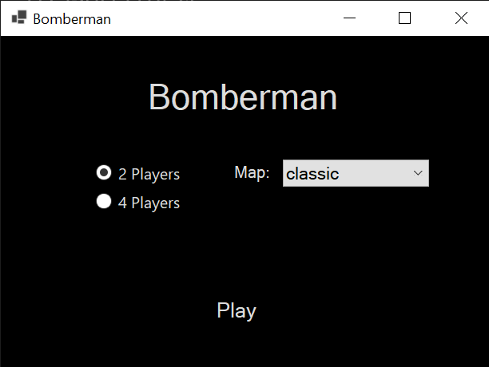
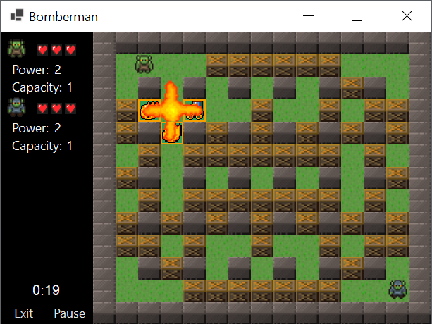
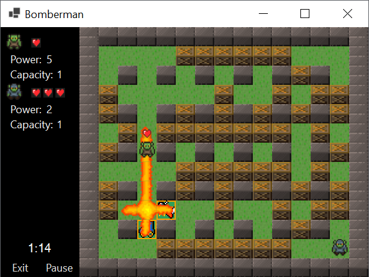
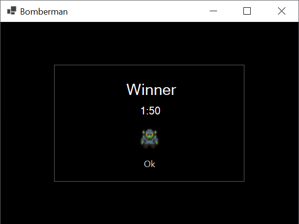

# Bomberman clone

Simple clone of Bomberman game in C# using WinForms.

## Run

If you want to try the game, you need to first build the code: 

`cd .\Bomberman\`

`dotnet build`

then copy textures and maps to the exe file.

`cp .\resrc\* .\bin\Debug\net7.0-windows\`

Now is everthing ready so go to the exe location and run it.

`cd .\bin\Debug\net7.0-windows\`

`.\Bomberman.exe`

## Control

### Player 1
 - Movement: arrow keys
 - Bomb: shift

### Player 2
 - Movement: wsad
 - Bomb: q

### Player 3
 - Movement: tgfh
 - Bomb: v

### Player 4
 - Movement: ikjl
 - Bomb: p

Power-Upy:
Fire-Up - bomb explosion range +1.
Bomb-Up - number of bombs +1.
Kick - kick bomb away.
Skate - speed up player.

## Screenshots

